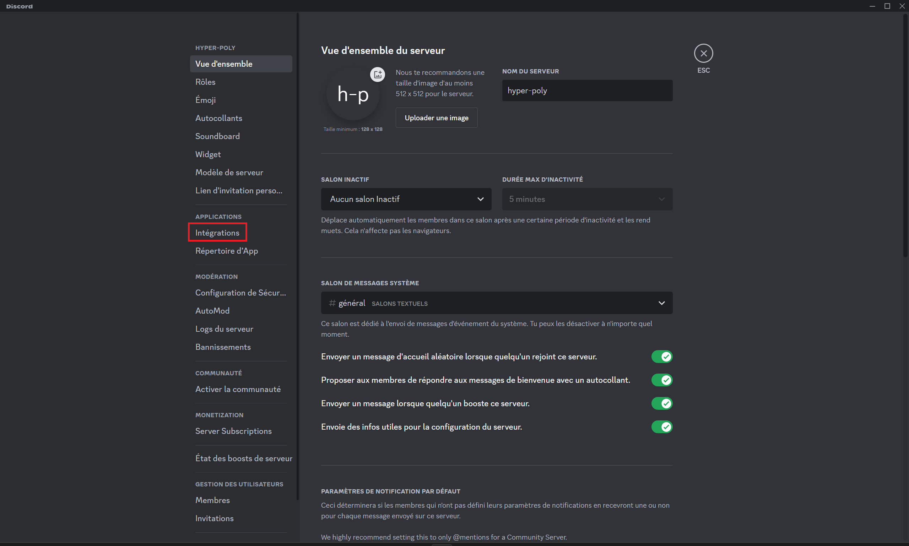
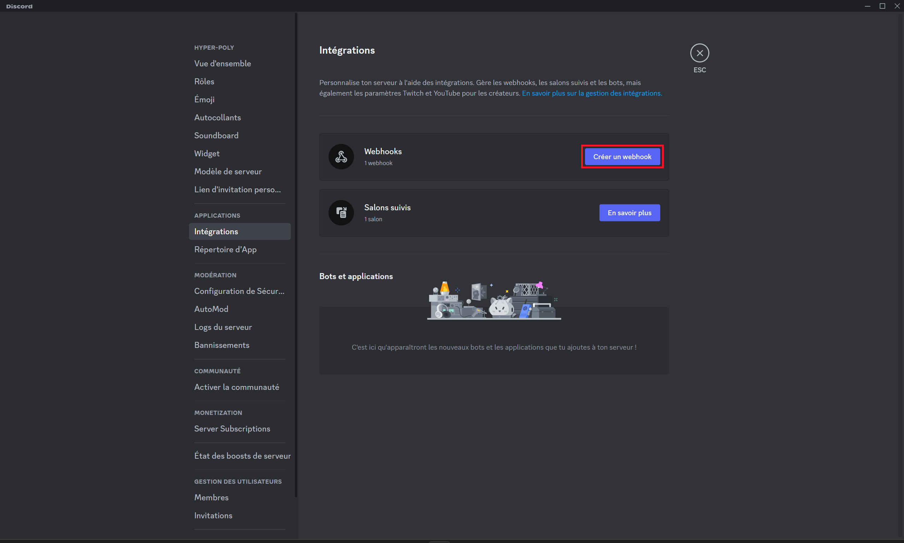
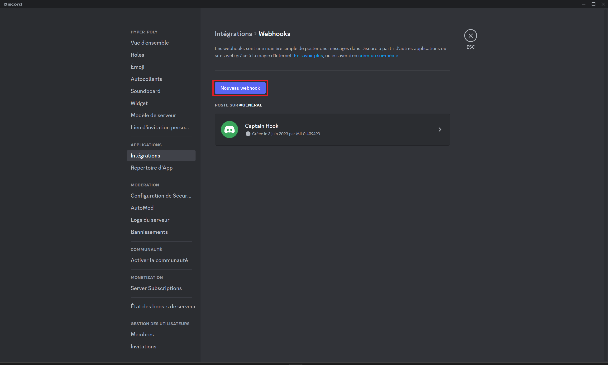
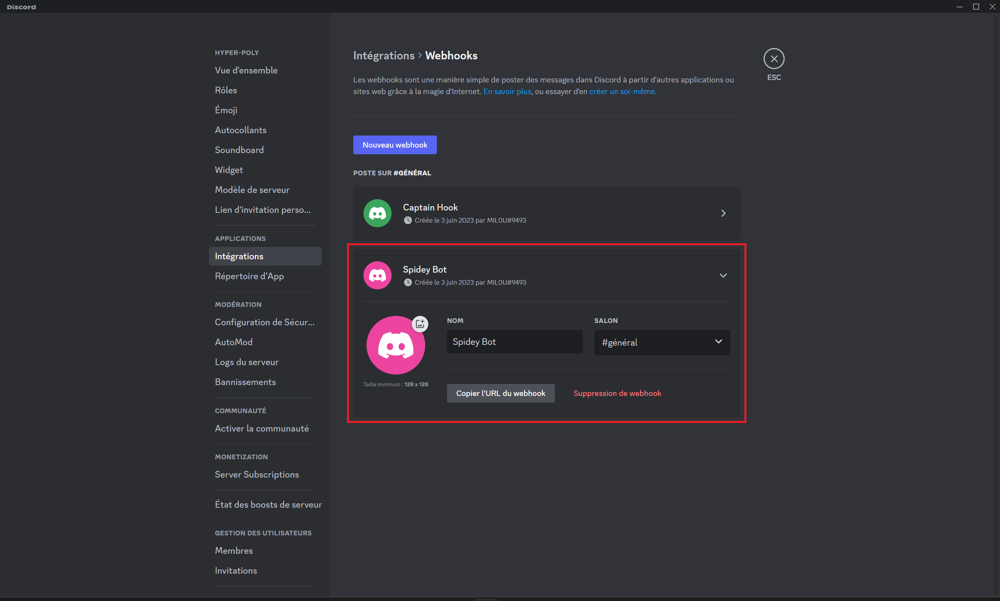
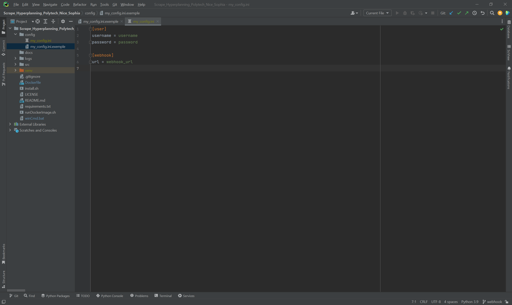

# Scrape Hyperplanning Polytech Nice Sophia

Le but de cette application est d'être notifié dès qu'une nouvelle note est ajouté à Hyperplanning.

Pour ce faire, nous avons 2 étapes :
- Création d'un webhook Discord
- Lancer l'application

Cette application utilise la version 3.11 de Python (https://firefox-source-docs.mozilla.org/testing/geckodriver/Support.html). Il utilise la librairie Selenium avec Mozilla Firefox-esr v102.11.0
et geckodriver v0.33.0 comme WebDriver (https://github.com/mozilla/geckodriver/releases).

### Création d'un webhook Discord

Aller dans les paramètres du serveur et ensuite sélectionner "Intégrations" :

Cliquer sur "Crée un webhook" :

Cliquer sur "Nouveau webhook" :

Il suffit maintenant de customiser comme vous le souhaiter :

### Lancé l'application

##### Avec Docker

- Premièrement il faut installer Docker sur votre machine : https://docs.docker.com/engine/install/
- Ensuite vous devez créer et remplir le fichier de configuration : my_config.ini comme dans l'exemple : [exemple](config/my_config.ini.exemple)

- Il n'y a plus qu'à exécuter le script qui va build et run l'image docker :
  - linux : [runDockerImage.sh](runDockerImage.sh) (il faut rendre le exécutable grâce à cette commande : `chmod +x runDockerImage.sh`)
  - cmd/powerShell : [runDockerImage.bat](runDockerImage.bat)
